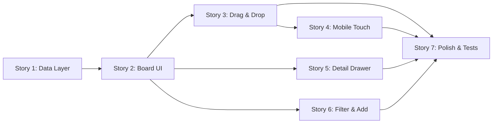

# PRD: Job Application Status Kanban Board

## Overview

Build a **Kanban board** for tracking job application statuses within the existing admin dashboard (`/admin/jobs`). The board visualizes jobs across pipeline stages (`applied` → `interview hr` → `interview tech` → `interview final` → `test task` → `offer` → `accepted` / `rejected`) and allows drag-and-drop status changes with **optimistic UI updates** — the board reacts instantly without waiting for server confirmation.

## Key Requirements

| Requirement | Priority | Rationale |
|---|---|---|
| **Instant status updates** (optimistic UI) | 🔴 Critical | User must never wait for server round-trip |
| **Mobile-first responsive** | 🔴 Critical | Must be usable on phones with touch gestures |
| **SvelteKit Remote Functions** | 🔴 Critical | Project architectural standard |
| **Type-safe end-to-end** | 🟡 High | Consistent with existing codebase conventions |
| **Accessible** | 🟡 High | Keyboard navigation, ARIA attributes |
| **Animated transitions** | 🟢 Medium | Smooth card movement, column highlights |

## Existing Infrastructure

| Layer | What Exists | Reference |
|---|---|---|
| API types | `paths`, `operations` with Job CRUD, status enum | [types.ts](file:///home/yaro/repos/svelte-personal-site/src/lib/api/types.ts) |
| API client | `openapi-fetch` client with typed helpers | [client.ts](file:///home/yaro/repos/svelte-personal-site/src/lib/api/client.ts) |
| Remote functions | `$app/server` — `query`, `command`, `form` in `/src/lib/remotes/*.remote.ts` | [auth.remote.ts](file:///home/yaro/repos/svelte-personal-site/src/lib/remotes/auth.remote.ts) |
| Validation | Valibot schemas | `valibot ^1.3.1` |
| UI components | ShadCN Svelte (button, card, input, label, checkbox) | [components/ui](file:///home/yaro/repos/svelte-personal-site/src/lib/components/ui) |
| Design system | Tailwind v4 with Kinetic Orange palette, Space Grotesk headings | [layout.css](file:///home/yaro/repos/svelte-personal-site/src/routes/layout.css) |
| Auth guard | `hooks.server.ts` redirects unauthenticated users from `/admin/*` | [hooks.server.ts](file:///home/yaro/repos/svelte-personal-site/src/hooks.server.ts) |

## Job Status Enum (from API)

```typescript
type JobStatus = "rejected" | "applied" | "interview hr" | "interview tech" 
               | "interview final" | "test task" | "offer" | "accepted";
```

The Kanban columns map directly to these statuses. `rejected` is shown as a special "archive/dismissed" column (collapsible at the end or bottom).

---

## User Review Required

### Decisions Made ✅

| Decision | Choice |
|---|---|
| **Drag-and-drop** | Native HTML5 Drag & Drop API — no external library |
| **Mobile layout** | Single-column view with collapsible status groups (accordion) |
| **Backend updates** | Use current `PUT` endpoint (full replacement). `PATCH` planned for future API iteration |
| **Rejected column** | **(C)** — Drop zone at the bottom of the board. Drag a card onto the reject zone to dismiss it |

---

## Story 1: Data Layer — Remote Functions for Job CRUD

**Goal**: Create type-safe remote functions for job operations, following the established `*.remote.ts` pattern.

> [!NOTE]
> All remote functions go in `/src/lib/remotes/jobs.remote.ts` and use Valibot schemas for argument validation. The API client (`openapi-fetch`) handles actual HTTP calls.

---

### Task 1.1: Create Job API Client Helpers

**File**: `src/lib/api/jobs.ts` (NEW)

Create typed wrapper functions around `openapi-fetch` client for Job endpoints, mirroring the pattern in [auth.ts](file:///home/yaro/repos/svelte-personal-site/src/lib/api/auth.ts):

- `getJobs(params?)` → `GET /api/v1/job/` with optional `page`, `pageSize`, `workspaceId`
- `createJob(body)` → `POST /api/v1/job/`
- `updateJob(id, body)` → `PUT /api/v1/job/{id}`
- `deleteJob(id)` → `DELETE /api/v1/job/{id}`

Export a `Job` type alias from `components['schemas']` or derive it from the response type.

**Acceptance Criteria**:
- [ ] All 4 CRUD functions exported
- [ ] Full type safety — no `any` casts
- [ ] `Job` type exported for reuse

---

### Task 1.2: Create Jobs Remote Functions File

**File**: `src/lib/remotes/jobs.remote.ts` (NEW)

Implement remote functions using `query`, `command` from `$app/server`:

#### 1.2.1: `getJobsList` — query
```typescript
export const getJobsList = query(async () => {
  const { data, error } = await getJobs();
  if (error) throw new Error('Failed to fetch jobs');
  return data;
});
```

#### 1.2.2: `updateJobStatus` — command
Accepts `{ id: number, status: JobStatus }`. Fetches the current job, merges the status, and sends the full `PUT` request (since no PATCH available).

```typescript
const UpdateStatusSchema = v.object({
  id: v.number(),
  status: v.picklist(["rejected", "applied", "interview hr", ...])
});

export const updateJobStatus = command(UpdateStatusSchema, async ({ id, status }) => {
  // Fetch current job to get full object for PUT
  const { data: jobs } = await getJobs();
  const job = jobs?.find(j => j.id === id);
  if (!job) throw new Error('Job not found');
  
  const { error } = await updateJob(String(id), { ...job, status });
  if (error) throw new Error('Failed to update job status');
});
```

#### 1.2.3: `addJob` — form
Uses a Valibot schema for `title`, optional `url`, `description`, `status`.

#### 1.2.4: `removeJob` — command
Accepts `{ id: number }`, calls `deleteJob`.

**Acceptance Criteria**:
- [ ] All 4 remote functions exported
- [ ] Valibot schemas validate all inputs
- [ ] `getRequestEvent()` used where cookie forwarding is needed
- [ ] No `redirect()` used inside `command` functions (anti-pattern)

---

### Task 1.3: Create Shared Types Module

**File**: `src/lib/types/job.ts` (NEW)

Extract and re-export shared types so components don't import from `remote.ts` or `api/types.ts` directly:

```typescript
export type JobStatus = "rejected" | "applied" | "interview hr" | "interview tech" 
                       | "interview final" | "test task" | "offer" | "accepted";

export const JOB_STATUSES: JobStatus[] = [...];

export const STATUS_CONFIG: Record<JobStatus, { label: string; color: string; icon: string }> = {
  "applied": { label: "Applied", color: "blue", icon: "send" },
  "interview hr": { label: "HR Interview", color: "violet", icon: "phone" },
  // ...
};
```

**Acceptance Criteria**:
- [ ] `JobStatus` type, `JOB_STATUSES` array, and `STATUS_CONFIG` map exported
- [ ] Colors align with the existing design system palette
- [ ] No dependency on remote function file

---

## Story 2: Kanban Board Core UI

**Goal**: Build the main board layout with status columns and job cards, rendered at `/admin/jobs`.

---

### Task 2.1: Create `KanbanBoard.svelte` Component

**File**: `src/lib/components/admin/kanban/KanbanBoard.svelte` (NEW)

The root board component that:
- Receives a reactive `jobs` array (from `query` remote function)
- Groups jobs by `status` into columns using `$derived`
- Renders `KanbanColumn` for each status
- Handles the responsive breakpoint switch (horizontal → vertical)

```svelte
<script lang="ts">
  import { type Job } from '$lib/types/job';
  import { JOB_STATUSES } from '$lib/types/job';
  
  let { jobs, onStatusChange }: { 
    jobs: Job[]; 
    onStatusChange: (id: number, newStatus: JobStatus) => void 
  } = $props();

  const grouped = $derived(
    JOB_STATUSES.reduce((acc, status) => {
      acc[status] = jobs.filter(j => j.status === status);
      return acc;
    }, {} as Record<JobStatus, Job[]>)
  );
</script>
```

**Layout**: CSS Grid with `auto-fill` columns on desktop, single column on mobile.

**Acceptance Criteria**:
- [ ] Board renders all status columns in pipeline order
- [ ] Groups derived reactively — no manual subscription
- [ ] Component uses `$props()` (Svelte 5 runes)
- [ ] Responsive layout breakpoint at `768px`

---

### Task 2.2: Create `KanbanColumn.svelte` Component

**File**: `src/lib/components/admin/kanban/KanbanColumn.svelte` (NEW)

Each column displays:
- **Header**: Status label, job count badge, status color indicator
- **Card list**: Scrollable area with `KanbanCard` components
- **Empty state**: "No jobs" placeholder with subtle illustration
- **Drop zone**: Visual feedback when dragging a card over

**Acceptance Criteria**:
- [ ] Column header shows status label + count
- [ ] Scroll container for cards with `overflow-y: auto`
- [ ] Empty state rendered when column has 0 jobs
- [ ] Status color from `STATUS_CONFIG`

---

### Task 2.3: Create `KanbanCard.svelte` Component

**File**: `src/lib/components/admin/kanban/KanbanCard.svelte` (NEW)

Each card shows:
- **Title** (job title, truncated to 2 lines)
- **Company/URL** (parsed from `url` field)
- **Status badge** (current status with color)
- **Time indicator** (e.g., "3 days in this stage" computed from `lastCommuncationDate`)
- **Quick actions**: kebab menu (⋮) with "View", "Edit", "Delete"
- **AI indicators**: small icons if `aiSummary` or `aiMatchAnalysis` exist

**Visual**: Uses the existing `card` design token with subtle hover elevation.

**Acceptance Criteria**:
- [ ] Card displays title, URL domain, and time-in-stage
- [ ] Hover/focus state with elevation change
- [ ] Click opens detail drawer (Task 5.1)
- [ ] `draggable="true"` attribute set
- [ ] AI summary indicators shown when data exists

---

### Task 2.4: Create `barrel export` for Kanban Components

**File**: `src/lib/components/admin/kanban/index.ts` (NEW)

```typescript
export { default as KanbanBoard } from './KanbanBoard.svelte';
export { default as KanbanColumn } from './KanbanColumn.svelte';
export { default as KanbanCard } from './KanbanCard.svelte';
```

**Acceptance Criteria**:
- [ ] All kanban components re-exported from index

---

### Task 2.5: Wire Board to Jobs Route

**File**: `src/routes/admin/jobs/+page.svelte` (NEW)

This page:
1. Calls `getJobsList()` from the remote function (reactive query)
2. Passes the result to `<KanbanBoard>`
3. Handles the `onStatusChange` callback (triggers `updateJobStatus` command)
4. Shows loading skeleton while initial data loads
5. Shows error state if fetch fails

**Acceptance Criteria**:
- [ ] Page imports and calls `getJobsList` from `jobs.remote.ts`
- [ ] Board renders with live data
- [ ] Loading skeleton shown on initial load
- [ ] Error boundary with retry button

---

## Story 3: Drag-and-Drop with Optimistic Updates

**Goal**: Enable card dragging between columns with instant visual feedback. The UI updates immediately; server sync happens in the background with rollback on failure.

> [!TIP]
> **Optimistic Update Pattern**: Update local `$state` immediately on drop → fire `command` in background → on failure, revert the local state and show toast notification.

---

### Task 3.1: Implement Drag State Store

**File**: `src/lib/components/admin/kanban/kanban-state.svelte.ts` (NEW)

A module-level reactive store using Svelte 5 runes:

```typescript
// Reactive state for the drag operation
let draggedJob = $state<Job | null>(null);
let dragOverColumn = $state<JobStatus | null>(null);
let isDropping = $state(false);

export function startDrag(job: Job) { draggedJob = job; }
export function endDrag() { draggedJob = null; dragOverColumn = null; }
export function setDragOver(status: JobStatus | null) { dragOverColumn = status; }

export function getDragState() {
  return { 
    get draggedJob() { return draggedJob; },
    get dragOverColumn() { return dragOverColumn; },
    get isDropping() { return isDropping; }
  };
}
```

**Acceptance Criteria**:
- [ ] Drag state is reactive and shared across column/card components
- [ ] No `$effect` used for state management (use `$state` + functions)
- [ ] Clean separation between drag state and job data state

---

### Task 3.2: Add Desktop Drag-and-Drop (HTML5 API)

**Files**: Modify `KanbanCard.svelte`, `KanbanColumn.svelte`

**KanbanCard.svelte**:
- `ondragstart`: set `draggedJob`, set `dataTransfer` with job ID
- `ondragend`: clear drag state
- Visual: card becomes semi-transparent (`opacity: 0.5`) while dragging

**KanbanColumn.svelte**:
- `ondragover`: prevent default, set `dragOverColumn`
- `ondragleave`: clear `dragOverColumn`
- `ondrop`: fire the `onStatusChange` callback
- Visual: column gets a highlighted border/background when receiving a drag

**Acceptance Criteria**:
- [ ] Cards draggable between columns on desktop
- [ ] Visual feedback on both dragged card and target column
- [ ] Drop fires the status change callback
- [ ] Drag state cleaned up on `dragend`

---

### Task 3.3: Implement Optimistic Update Logic

**File**: Modify `src/routes/admin/jobs/+page.svelte`

The `onStatusChange` handler:

```typescript
async function handleStatusChange(jobId: number, newStatus: JobStatus) {
  // 1. Snapshot current state for rollback
  const previousJobs = [...jobs];
  
  // 2. Optimistic update — instant UI change
  jobs = jobs.map(j => j.id === jobId ? { ...j, status: newStatus } : j);
  
  // 3. Fire server command in background
  try {
    await updateJobStatus({ id: jobId, status: newStatus });
    // Optional: refetch to sync any server-side changes
  } catch (error) {
    // 4. Rollback on failure
    jobs = previousJobs;
    showToast('Failed to update status. Change reverted.', 'error');
  }
}
```

**Acceptance Criteria**:
- [ ] UI updates instantly on drop (no spinner/loading)
- [ ] Server call happens asynchronously in background
- [ ] On server error, state rolls back to previous position
- [ ] Toast notification shown on rollback
- [ ] Uses `.updates()` pattern if applicable to invalidate `getJobsList` query

---

### Task 3.4: Add Reorder Animation

**Files**: Modify `KanbanColumn.svelte`, `KanbanCard.svelte`

Use Svelte's `animate:flip` and `transition:` directives for smooth card movement:

```svelte
{#each columnJobs as job (job.id)}
  <div animate:flip={{ duration: 250 }} transition:fade={{ duration: 150 }}>
    <KanbanCard {job} />
  </div>
{/each}
```

**Acceptance Criteria**:
- [ ] Cards animate smoothly when reordering
- [ ] No layout jumps during drag operations
- [ ] Animation duration ≤ 300ms (feels snappy)

---

## Story 4: Mobile Touch Support

**Goal**: Full Kanban functionality on mobile devices with native-feeling touch interactions.

---

### Task 4.1: Implement Mobile Layout (Collapsible Columns)

**File**: Modify `KanbanBoard.svelte`

On screens `< 768px`:
- Columns stack vertically
- Each column is collapsible (accordion) with the header as toggle
- Active column (with most recent activity) is expanded by default
- Column count badge visible in collapsed state

```svelte
<script>
  let expandedColumn = $state<JobStatus>('applied');
  const isMobile = /* media query state */;
</script>
```

**Acceptance Criteria**:
- [ ] Columns stack vertically on mobile
- [ ] Tap header to expand/collapse
- [ ] Smooth height transition animation
- [ ] Only one column expanded at a time
- [ ] Job count visible on collapsed columns

---

### Task 4.2: Implement Touch Drag-and-Drop

**File**: Modify `KanbanCard.svelte`, add `useTouchDrag.svelte.ts` action

Since HTML5 drag API is poorly supported on mobile, implement touch-based drag:

```typescript
// src/lib/components/admin/kanban/actions/useTouchDrag.svelte.ts
export function touchDrag(node: HTMLElement, params: { job: Job; onDrop: ... }) {
  // touchstart: clone card as drag ghost, track finger position
  // touchmove: move ghost element, detect column under touch point  
  // touchend: determine target column, fire onDrop
}
```

**Behavior**:
- **Long press** (300ms) activates drag mode (prevents accidental drags while scrolling)
- Drag ghost follows finger
- Haptic feedback via `navigator.vibrate(50)` (if supported)
- Auto-scroll when near edge of viewport

**Acceptance Criteria**:
- [ ] Long-press to initiate drag on mobile
- [ ] Visual drag ghost follows finger
- [ ] Drop detection works with vertical column layout
- [ ] Scrolling not blocked by drag detection
- [ ] Drag cancel on swipe-away

---

### Task 4.3: Add Quick Status Change (Mobile Alternative)

**File**: Create `StatusPicker.svelte` (NEW)

For users who find drag cumbersome on mobile, add a tap-to-change-status menu:
- Tap the status badge on a card → shows a popover/bottom sheet with all statuses
- Selecting a status triggers the same optimistic update flow

**Acceptance Criteria**:
- [ ] Status badge is tappable on mobile
- [ ] Popover/bottom sheet shows all available statuses
- [ ] Selected status triggers optimistic update
- [ ] Current status is visually indicated

---

### Task 4.4: Mobile Viewport & Touch Optimizations

**Files**: Modify board components CSS

- Minimum touch target size: `44px × 44px`
- Card padding increased on mobile (`p-4` instead of `p-3`)
- Pull-to-refresh gesture to reload jobs
- Prevent iOS bounce scroll on the board
- Safe area insets for notched devices

**Acceptance Criteria**:
- [ ] All interactive elements ≥ 44px minimum dimension
- [ ] No accidental scrolls during card interaction
- [ ] Tested on iOS Safari and Android Chrome viewports

---

## Story 5: Job Detail Drawer

**Goal**: Side drawer (desktop) / bottom sheet (mobile) showing full job details when a card is clicked.

---

### Task 5.1: Create `JobDetailDrawer.svelte` Component

**File**: `src/lib/components/admin/kanban/JobDetailDrawer.svelte` (NEW)

**Content**:
- Job title, URL (clickable link), full description
- Current status with dropdown to change
- Dates: `nextEventDate`, `lastCommuncationDate`
- Notes (editable textarea)
- AI Summary section (collapsible, rendered as markdown)
- AI Match Analysis section (collapsible)
- Action buttons: "Edit", "Delete", "Close"

**Behavior**:
- Slides in from right on desktop (width: `480px`)
- Slides up from bottom on mobile (height: `80vh`, draggable to dismiss)
- `Escape` key or backdrop click closes
- Focus trapped inside drawer when open

**Acceptance Criteria**:
- [ ] Drawer renders all job fields
- [ ] Status change from drawer triggers optimistic update
- [ ] Responsive: side panel on desktop, bottom sheet on mobile
- [ ] Accessible: focus trap, `role="dialog"`, `aria-modal`
- [ ] Smooth slide transition

---

### Task 5.2: Integrate Notes Editing via Remote Function

**File**: Modify `jobs.remote.ts`

Add a `updateJobNotes` command:
```typescript
export const updateJobNotes = command(
  v.object({ id: v.number(), notes: v.string() }),
  async ({ id, notes }) => { /* PUT full job with updated notes */ }
);
```

Debounce the save in the drawer (500ms after last keystroke).

**Acceptance Criteria**:
- [ ] Notes auto-save with debounce
- [ ] Save indicator ("Saving..." / "Saved ✓")
- [ ] Optimistic: local state updates immediately

---

## Story 6: Filtering, Search & Add Job

**Goal**: Allow filtering the board by text search, and adding new jobs.

---

### Task 6.1: Add Board Header with Search

**File**: Create `KanbanHeader.svelte` (NEW)

Located above the board:
- **Search input**: Filters cards across all columns by title (client-side, instant)
- **"Add Job" button**: Opens add-job form/modal
- **View toggle**: "Board" vs "List" (only Board implemented now, List is future placeholder)
- **Job count**: "12 active jobs"

**Acceptance Criteria**:
- [ ] Search filters cards in real-time (client-side)
- [ ] Search highlights matching text in cards
- [ ] Empty search state handled
- [ ] "Add Job" button visible and functional

---

### Task 6.2: Implement Add Job Modal

**File**: Create `AddJobModal.svelte` (NEW)

Uses the `addJob` form remote function:
- Fields: Title (required), URL, Description, Initial Status (dropdown, default: "applied")
- Progressive enhancement: works without JS via `<form>` + `form.enhance`
- On success: new card appears in the correct column (optimistic via `.updates()`)

**Acceptance Criteria**:
- [ ] Form uses `addJob` remote function
- [ ] Valibot validation errors shown inline
- [ ] Progressive enhancement (works without JS)
- [ ] New job appears instantly in correct column
- [ ] Modal closes on success

---

### Task 6.3: Implement Client-Side Filter Logic

**File**: Modify `KanbanBoard.svelte`

```typescript
let searchQuery = $state('');

const filteredJobs = $derived(
  searchQuery.trim() === '' 
    ? jobs 
    : jobs.filter(j => j.title.toLowerCase().includes(searchQuery.toLowerCase()))
);
```

Pass `filteredJobs` instead of `jobs` to column grouping.

**Acceptance Criteria**:
- [ ] Filter is case-insensitive
- [ ] Filters across all columns simultaneously
- [ ] Empty columns still show (with "No matching jobs" state)
- [ ] Clear search button resets filter

---

## Story 7: Polish, Accessibility & Testing

**Goal**: Production-quality polish, accessibility compliance, and test coverage.

---

### Task 7.1: Add Keyboard Navigation

**Files**: Modify all Kanban components

- `Tab` / `Shift+Tab`: navigate between cards
- `Enter` / `Space`: open card detail drawer
- `Arrow Left/Right`: move card to adjacent column (triggers status change)
- `Escape`: cancel drag or close drawer
- Focus indicators visible on all interactive elements

**Acceptance Criteria**:
- [ ] Full board navigable via keyboard only
- [ ] Arrow keys trigger status change with optimistic update
- [ ] Focus ring visible (using `outline-ring` from design system)
- [ ] Screen reader announces column changes

---

### Task 7.2: Add ARIA Attributes

**Files**: Modify all Kanban components

- Board: `role="region"`, `aria-label="Job application kanban board"`
- Columns: `role="list"`, `aria-label="{status} - {count} jobs"`
- Cards: `role="listitem"`, `aria-grabbed`, `aria-dropeffect`
- Drawer: `role="dialog"`, `aria-modal="true"`, `aria-labelledby`

**Acceptance Criteria**:
- [ ] ARIA attributes added to all interactive elements
- [ ] Live region announces drag results to screen readers
- [ ] Tested with VoiceOver/NVDA basics

---

### Task 7.3: Add Toast Notification System

**File**: `src/lib/components/ui/toast/` (NEW)

Lightweight toast component for:
- Success: "Status updated to {status}"
- Error: "Failed to update. Change reverted."
- Info: "Job added successfully"

Uses Svelte 5 `$state` store pattern — no external library.

**Acceptance Criteria**:
- [ ] Toast appears in bottom-right (desktop) / bottom-center (mobile)
- [ ] Auto-dismiss after 4 seconds
- [ ] Dismiss on click/swipe
- [ ] Stacks multiple toasts

---

### Task 7.4: Loading Skeleton

**File**: Create `KanbanSkeleton.svelte` (NEW)

Renders a shimmer/pulse skeleton matching the board layout:
- Skeleton columns with ghost cards
- Uses `animate-pulse` from Tailwind

**Acceptance Criteria**:
- [ ] Skeleton matches full board layout
- [ ] Shown during initial data fetch
- [ ] Smooth fade-out transition to real content

---

### Task 7.5: Write Component Tests

**Files**: `src/lib/components/admin/kanban/*.test.ts` (NEW)

Using Vitest + `vitest-browser-svelte`:
- `KanbanCard.test.ts`: renders title, URL, status badge; drag events fire correctly
- `KanbanColumn.test.ts`: renders correct count, empty state, drop zone
- `KanbanBoard.test.ts`: groups jobs by status, search filters work
- `StatusPicker.test.ts`: shows all statuses, fires selection callback

**Acceptance Criteria**:
- [ ] ≥ 80% component test coverage for Kanban module
- [ ] Tests run with `npm run test:unit`
- [ ] No mocking of remote functions (test pure UI behavior)

---

### Task 7.6: Write E2E Test

**File**: `tests/kanban.spec.ts` (NEW)

Playwright test covering:
1. Navigate to `/admin/jobs` (authenticated)
2. Board renders with columns
3. Drag a card from "Applied" to "Interview HR"
4. Verify card appears in new column
5. Refresh page — verify persistence

**Acceptance Criteria**:
- [ ] E2E test passes in CI
- [ ] Tests run with `npm run test:e2e`

---

## File Summary

### New Files

| File | Story | Purpose |
|---|---|---|
| `src/lib/api/jobs.ts` | 1 | Typed API client wrappers |
| `src/lib/remotes/jobs.remote.ts` | 1 | Remote functions (query, command, form) |
| `src/lib/types/job.ts` | 1 | Shared types & config |
| `src/lib/components/admin/kanban/KanbanBoard.svelte` | 2 | Root board component |
| `src/lib/components/admin/kanban/KanbanColumn.svelte` | 2 | Column with cards |
| `src/lib/components/admin/kanban/KanbanCard.svelte` | 2 | Individual job card |
| `src/lib/components/admin/kanban/index.ts` | 2 | Barrel export |
| `src/lib/components/admin/kanban/kanban-state.svelte.ts` | 3 | Drag state store |
| `src/lib/components/admin/kanban/StatusPicker.svelte` | 4 | Mobile status change menu |
| `src/lib/components/admin/kanban/actions/useTouchDrag.svelte.ts` | 4 | Touch drag action |
| `src/lib/components/admin/kanban/JobDetailDrawer.svelte` | 5 | Detail drawer/bottom sheet |
| `src/lib/components/admin/kanban/KanbanHeader.svelte` | 6 | Search, filters, add button |
| `src/lib/components/admin/kanban/AddJobModal.svelte` | 6 | Add job form modal |
| `src/lib/components/ui/toast/` | 7 | Toast notification system |
| `src/lib/components/admin/kanban/KanbanSkeleton.svelte` | 7 | Loading skeleton |
| `src/routes/admin/jobs/+page.svelte` | 2 | Jobs page with Kanban |
| `tests/kanban.spec.ts` | 7 | E2E test |

### Modified Files

| File | Story | Change |
|---|---|---|
| `src/routes/admin/+page.svelte` | 2 | Add link/navigation to jobs board |

---

## Suggested Execution Order



**Critical Path**: Story 1 → Story 2 → Story 3 → Story 7

**Parallel Work**: Stories 4, 5, 6 can be developed in parallel once Story 2 is complete.

---

## Open Questions

> [!IMPORTANT]
> 1. **Mobile layout preference**: Collapsible accordion columns vs. horizontal scroll with snap? (see Task 4.1)
> 2. **Rejected column treatment**: Option A, B, or C? (see User Review section above)
> 3. **Job ordering within columns**: Should we support manual reordering within a column, or sort by date?
> 4. **Backend API**: Does the backend need a new endpoint for batch status updates, or is individual `PUT` sufficient for MVP?
> 5. **Workspace scope**: The `getJobs` API accepts `workspaceId`. Should the board be scoped to a specific workspace, or show all jobs?
